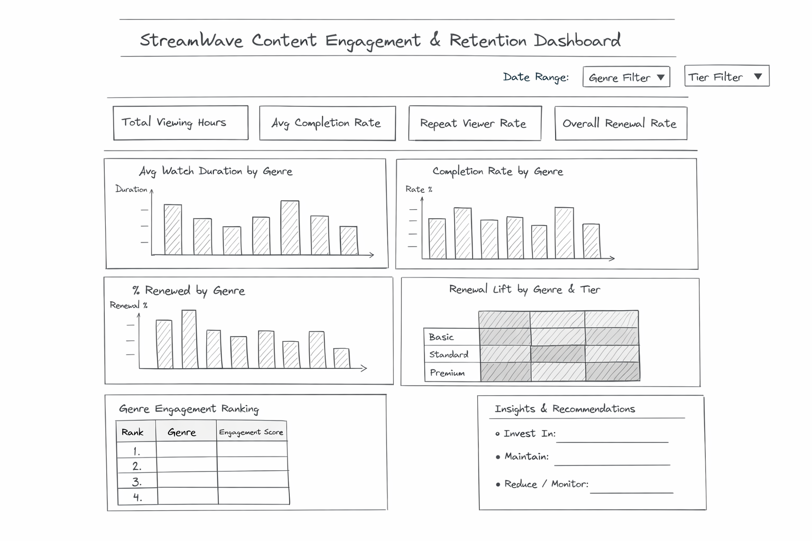

# 🎬 Utilizing Viewers’ Engagement for Strategic Content Investment in the Media & Entertainment Sector

## 🏬 Microsoft Excel & Power Tools Analytics Project

---

## 🪄 Introduction

This project analyzes a **viewer engagement dataset** using **Microsoft Excel, Power Query, and Excel Power Tools** to uncover actionable insights that guide **content investment, retention optimization, and strategic decision-making** for a global streaming platform.

The analysis simulates a real-world business scenario at **StreamWave Entertainment**, demonstrating how data analytics supports executive-level decisions in the Media & Entertainment industry.

---

## 📊 Badges


---

## 🧭 Business Context

**StreamWave Entertainment** is a global streaming platform with over **150 million subscribers** across 190+ countries. As competition intensifies and content production costs rise, leadership faces increasing pressure to:

- Allocate limited budgets effectively
- Reduce subscriber churn
- Prioritize high-ROI content genres
- Maintain competitive differentiation through data-driven insights

Despite a vast content library, not all genres contribute equally to engagement and retention—making analytics critical to investment strategy.

---

## 🎯 Purpose of the Project

The primary goal of this project is to **identify top-performing content genres** that drive:

- Viewer engagement quality (completion & repeat viewing)
- Subscriber retention and renewal
- Efficient allocation of marketing and production spend

Using **Excel-based analytics**, the project translates raw viewing logs into executive-ready insights.

---

## 📈 Expected Outcomes

- A **data-driven framework** for content investment decisions
- Identification of **high-ROI genres**
- Reduced churn through better-aligned content strategy
- Improved personalization and recommendation logic
- Executive dashboards for rapid decision-making

---

## ⚠️ Disclaimer

This dataset is used **strictly for learning and portfolio demonstration purposes**.

- It does **not represent real StreamWave data**
- All entities, metrics, and scenarios are fictional or anonymized

---

## 📑 Table of Contents

- [Project Overview](#-project-overview)
- [Dataset Description](#-dataset-description)
- [Methodology (CRISP-DM)](#-methodology-crisp-dm)
- [Week 1: Analytics Foundation](#-week-1-analytics-foundation)
- [Week 2: Dashboard & Storytelling](#-week-2-dashboard--storytelling)
- [Key KPIs & Metrics](#-key-kpis--metrics)
- [Executive Dashboard](#-executive-dashboard)
- [Key Insights](#-key-insights)
- [Strategic Recommendations](#-strategic-recommendations)
- [Tools & Technologies](#-tools--technologies)
- [Conclusion](#-conclusion)
- [Author](#-author)

---

## 🧭 Project Overview

This project demonstrates how **viewer behavior data** can be transformed into strategic insights that inform:

- Content acquisition & production
- Genre-level investment prioritization
- Marketing optimization
- Retention-focused decision-making

The analysis emphasizes **business impact**, not just metrics.

---

## 🗂️ Dataset Description

The dataset captures simulated streaming activity and includes:

- **User_ID** – Unique subscriber identifier
- **Demographics** – Age, Gender
- **Subscription Data** – Tier, Status, Renewal
- **Content Attributes** – Title, Genre, Duration, Release Year
- **Viewing Behavior** – Watch Duration, Completion Flag, Watch Date

This structure supports engagement, retention, and churn analysis.

---
📄 **Download Raw Dataset:**  
👉 [streamwave_viewing_logs.csv](data/raw/streamwave_viewing_logs.csv)

---
## 🔍 Methodology (CRISP-DM)

This project follows the **CRISP-DM framework**:

1. **Business Understanding** – Define retention and ROI challenges
2. **Data Understanding** – Explore structure, patterns, anomalies
3. **Data Preparation** – Clean, validate, enrich datasets
4. **Modeling** – Pivot tables and calculated metrics
5. **Evaluation** – Validate insights against business goals
6. **Deployment** – Dashboards and executive presentation

---

## 🧹 Week 1: Analytics Foundation

### Day 1 – Project Kickoff & Data Orientation
- Defined business problem and success metrics
- Identified key analytical questions
- Established KPIs aligned to engagement & retention

### Day 2 – Data Ingestion & Quality Assessment
- Imported CSV files into Excel
- Enforced data types
- Validated row counts, uniqueness, nulls, and outliers
- Logged data quality issues and remediation plan

### Day 3 – KPI Calculation
- Built pivot tables by genre
- Calculated:
  - Completion Rate
  - Repeat Viewer Rate
  - Average Watch Duration
  - Concurrent Viewers
  


### Day 4 – Retention Analysis
- Cross-tabulated Genre vs Renewal_Status
- Ranked genres by composite engagement score
- Identified churn-resistant content categories

### Day 5 – Interpretation & Insights
- Translated metrics into executive insights
- Defined where to invest, optimize, or deprioritize

---

## 📊 Week 2: Dashboard & Storytelling

> 📸 **Screenshot Placeholder – Dashboard Wireframe**  
> _Insert Excalidraw wireframe illustrating dashboard layout and information hierarchy._  
> **Filename suggestion:** `/dashboard/dashboard_wireframe.png`

### Day 1 – Dashboard Wireframing
- Designed layout using Excalidraw
- Defined visual hierarchy for executives

> 📸 **Screenshot Placeholder – Chart Design Samples**  
> _


### Day 2 – Chart Building
- Built bar, line, and KPI tile visuals
- Applied executive formatting & labeling standards
- Added slicers for interactivity

> 📸 **Screenshot Placeholder – One-Page Dashboard**  
> 
> **


### Day 3 – One-Page Executive Dashboard
- KPI Tiles: Completion %, Renewal %
- Top 5 Genre Performance
- Monthly Engagement Trends

### Day 5 – Executive Presentation
- Converted dashboard insights into C-suite storytelling
- Delivered recommendations backed by data


### Day 1 – Dashboard Wireframing
- Designed layout using Excalidraw
- Defined visual hierarchy for executives

### Day 2 – Chart Building
- Built bar, line, and KPI tile visuals
- Applied executive formatting & labeling standards
- Added slicers for interactivity

### Day 3 – One-Page Executive Dashboard
- KPI Tiles: Completion %, Renewal %
- Top 5 Genre Performance
- Monthly Engagement Trends

### Day 5 – Executive Presentation
- Converted dashboard insights into C-suite storytelling
- Delivered recommendations backed by data

---

## 📌 Key KPIs & Metrics

- **Completion Rate**
- **Repeat Viewer Rate**
- **Average Watch Duration**
- **Renewal Rate / Retention Lift**
- **Concurrent Viewers**

These KPIs directly support ROI-driven content decisions.

---

## 📈 Executive Dashboard

> 📸 **Screenshot Placeholder – Executive Dashboard**  
> 
> ** 


## 📈 Download C-Suite Presentation:

> 📸 **Screenshot Placeholder – C-Suite Presentation**  
> **👉 [StreamWave_CSuite_Content_Strategy.pptx](slides/StreamWave_CSuite_Content_Strategy.pptx)


The Excel dashboard enables leadership to:

- Slice performance by genre
- Compare engagement vs retention
n- Identify high-impact investment areas
- Monitor churn-sensitive content


The Excel dashboard enables leadership to:

- Slice performance by genre
- Compare engagement vs retention
- Identify high-impact investment areas
- Monitor churn-sensitive content

---

## 💡 Key Insights

- **Drama** drives the highest views and repeat engagement
- **Comedy** balances strong engagement with loyalty
- **Horror** shows exceptional viewer loyalty
- **Biography** has high completion but weak retention
- **Sci-Fi & Action** offer scalable growth potential

---

## 🧠 Strategic Recommendations

1. Increase investment in **Drama and Comedy**
2. Develop niche sub-genres in **Sci-Fi and Action**
3. Refresh **Documentary formats** for broader appeal
4. Implement retention strategies for **Biography**
5. Use genre-driven personalization to reduce churn

---

## 🧰 Tools & Technologies

- **Microsoft Excel** – Analysis & dashboards
- **Power Query** – Data cleaning & transformation
- **Excel Pivot Tables** – KPI modeling
- **Excalidraw** – Dashboard wireframing

---

## 🏁 Conclusion

This project demonstrates how Excel-based analytics can deliver **enterprise-level insights** when aligned with business strategy. By focusing on engagement quality and retention—not just views—StreamWave can maximize ROI and maintain competitive advantage.

---

## 📁 GitHub Repository Structure

```text
streamwave-content-strategy/
│
├── data/
│   ├── raw/
│   │   └── streamwave_viewing_logs.csv
│   └── processed/
│       └── cleaned_streamwave_data.xlsx
│
├── dashboard/
│   ├── dashboard_wireframe.png
│   ├── genre_charts.png
│   └── streamwave_executive_dashboard.png
│
├── slides/
│   └── StreamWave_CSuite_Content_Strategy.pptx
│
├── README.md
└── LICENSE
```

This structure ensures clarity, scalability, and recruiter-friendly navigation.

---

## 👩‍💻 Author

**Charles Walton**  
Data Analyst | Business Intelligence | Media Analytics  
📧 cwalton1335@gmail.com


