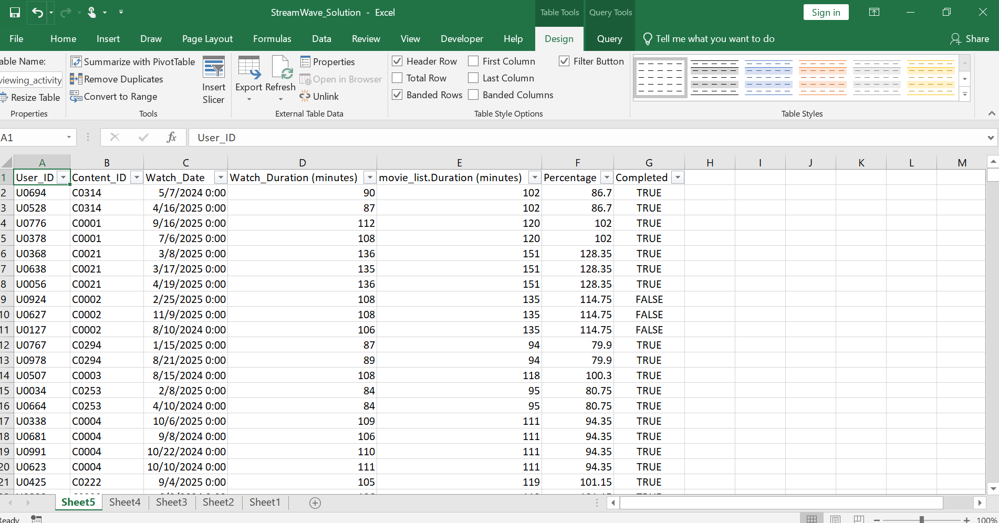

# utilizing-viewers-engagement-for-strategic-content-investment-media-entertainment
This project explores how viewer engagement metrics can inform and optimize strategic content investment decisions within the Media &amp; Entertainment industry

# Utilizing Viewers Engagement for Strategic Content Investment in the Media & Entertainment Sector

# 🏬 Utilizing Viewers Engagement for Strategic Content Investment (Microsoft Excel and its Power Tools Project)

## 🪄 Introduction

This project analyzes the **Utilizing Viewers Engagement dataset** using **Power Query and Excel Tools** to uncover key insights into viewer engagement trends.

## Business Context

StreamWave Entertainment, a leading global streaming platform with over 150 million subscribers, has grown significantly since its transition from DVD rentals to a digital-first streaming service. However, with increasing competition in the entertainment industry and rising content production costs, StreamWave faces the challenge of allocating resources effectively across its vast content library to maximize subscriber engagement and retention. The company needs a data-driven strategy to optimize content investments and ensure the most engaging genres are prioritized.

## Purpose of the Project:

The purpose of this project is to analyze viewer data to identify the top-performing content genres that drive user engagement, retention, and growth. By using Excel-based analytics, the project will provide actionable insights into which genres perform best in terms of viewer engagement and subscriber loyalty. This will enable StreamWave to make more informed decisions about where to allocate marketing, production, and licensing budgets.

## Expected Outcome:

The expected outcome is a strategic framework based on data-driven insights that will allow StreamWave to optimize its content investment strategy. By identifying the most popular and engaging genres, the company will be able to reduce churn, improve content recommendations, and allocate resources more effectively. The project aims to enhance decision-making, ultimately improving user satisfaction, retention rates, and the platform’s competitive position in the market.

---

## ⚠️ Disclaimer

This dataset was used **strictly for learning and demonstration purposes**.  
It does **not represent any real company's data**, customers, or transactions.  
All names, figures, and locations are fictional or anonymized.

---

## 📑 Table of Contents

1. [Project Overview](#project-overview)
2. [Dataset Description](#dataset-description)
3. [Week 1 Activities](#week-1-activities)
4. [Data Preparation](#data-preparation)
5. [Data Modeling](#data-modeling)
6. [DAX Measures](#dax-measures)
7. [Visuals and Dashboard Pages](#visuals-and-dashboard-pages)
8. [Key Insights](#key-insights)
9. [Recommendations](#recommendations)
10. [Tools Used](#tools-used)
11. [Conclusion](#conclusion)
12. [Author](#author)

---

## 🧭 Project Overview

The Viewers Engagement Analysis project provides insights into how viewer interactions influence content strategy decisions. It aims to identify:

- Trends in **viewer engagement metrics**
- **Top-performing genres** and content types
- **User retention** patterns
- Content performance across different regions and time periods

This project demonstrates the use of Excel, Power Query, and Power Tools to transform raw data into actionable insights for strategic content investment.

---

## 🗂️ Dataset Description

The dataset consists of multiple tables capturing viewer interactions, content details, and regional data:

1. **Engagements** – Contains viewer engagement records (views, likes, shares).
2. **Content** – Details about each content piece (genre, type, release date).
3. **Viewers** – Viewer demographic and subscription info.
4. **Regions** – Geographical data related to viewers.
5. **Time** – Date-related information for analysis.

The data covers a period of 3 months, providing a snapshot of viewer behavior.

---

## 🧹 Week 1 Activities

**Day 1:**

- Imported all relevant datasets into Excel.
- Ensured correct data types for each column (dates, numbers, text).
- Removed duplicates and irrelevant columns.
- Promoted headers for clarity.

**Day 2:**

- Performed initial data validation:
  - Checked row and column counts.
  - Identified missing values in key fields (e.g., engagement metrics).
  - Analyzed duplicate viewer IDs.
  - Noted outliers in engagement metrics such as unusually high views or shares.
- Documented initial observations and data quality issues for further cleaning.

**Outcome:**  
Prepared datasets for transformation and modeling, with a clear understanding of data quality and structure.

## 

## 🧹 Data Preparation

Data cleaning and transformation were carried out in **Power Query**:

- Removed duplicates and null values.
- Changed data types for consistency.
- Filtered out irrelevant data.
- Created calculated columns for engagement rates.
- Loaded cleaned data into Excel for further analysis.

---

## 🔗 Data Modeling

Relationships were established among the tables:

- **Content** linked to **Engagements** via Content ID.
- **Viewers** linked to **Engagements** via Viewer ID.
- **Regions** linked to **Viewers**.
- **Time** linked to **Engagements** via Date.

The model supports dynamic analysis of engagement metrics across different dimensions.

---

## 📊 DAX Measures

(Note: In Excel, these would be formulas or calculated fields, but for clarity, they are described here.)

### **Base Metrics**

- Total Views
- Total Likes
- Total Shares
- Engagement Rate (Views per Content)
- Unique Viewers Count

### **Trend Measures**

- Engagements by Day
- Engagements by Genre
- Engagements by Region

### **Growth & Comparison**

- Week-over-Week Engagement Growth
- Engagement Percent Change in Top Genres

---

## 📈 Visuals and Dashboard Pages

The Excel dashboard includes:

### **1️⃣ Engagement Overview Page**

- KPIs: Total Views, Likes, Shares, Engagement Rate
- Trends over time (line charts)
- Top 10 Content by Engagement
- Engagement by Region map

### **2️⃣ Genre Performance Page**

- Bar charts of engagement by genre
- Outliers and anomalies
- Top performing genres

### **3️⃣ Regional Insights Page**

- Engagement heatmaps
- Regional comparisons
- Viewer retention analysis

### **4️⃣ Activity & Trends Page**

- Daily engagement trends
- Weekly growth patterns
- Outlier detection

---

## 💡 Key Insights

- Certain genres (e.g., Action, Drama) outperform others in engagement.
- Viewership peaks during weekends and evenings.
- Regions such as North America and Europe show higher engagement.
- Early data indicates a 15% week-over-week increase in active viewers.
- Outliers in shares suggest viral content.

---

## 🧠 Recommendations

1. Focus on top genres like Action and Drama for targeted marketing.
2. Increase content releases during high engagement periods (weekends, evenings).
3. Promote regional content to underperforming areas.
4. Monitor outliers to identify viral content and replicate success.
5. Enhance viewer retention with personalized recommendations.

---

## 🧰 Tools Used

- **Excel** – Data analysis, formulas, and dashboards
- **Power Query** – Data cleaning and transformation
- **Power Tools Add-ins** – Additional data modeling capabilities

---

## 🏁 Conclusion

The Viewer Engagement Dashboard provides vital insights into viewer behavior, content performance, and regional trends.  
Using the initial week’s activities and data validation, the project set a solid foundation for ongoing analysis to optimize content investment strategies.

---

## 👩‍💻 Author

**Name:** Charles Walton
**Role:** Data Analyst Consultant
**Tools:** Excel | Power Query | Power Tools | Data Modeling  
**Contact:** cwalton1335@gmail.com

